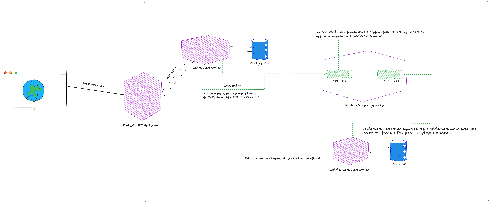

# Опис компонентів системи

На малюнку, схематично зображена архітектура, а також комунікація між сервісами. Розписую більш детально, що і для яких цілей використовується:
1. KrakenD API Gateway - усі компоненти знаходяться в спільному нетворку i API Gateway використовується для точки входу в додаток і контролю REST API.
2. Users microservice і PostgreSQL - створення користувача, запис в базу даних і відправка івенту `user.created`.
3. Notifications microservice i MongoDB - даний мікросервіс підписаний на чергу `notifications` i слухає усі події, які туди приходять. На практиці туди можуть пушити події, різні мікросервіси.
Після отримання даних, генеруємо нотифікацію і відправляємо на мок URL, імітуючи пуш сповіщення. Окрім цього записуємо дані в MongoDB.
Я обрав MongoDB, так як даний мікросервіс, потенційно буде під постійним навантаженням, з чим mongo дуже добре справиться, а також враховуючи те що ми можемо мати багато типів нотифікацій, які можуть бути дуже різними, schema less база даних буде хорошим рішенням.
4. RabbitMQ - використовується для комунікації, а також забезпечує `decoupling` між мікросервісами.

# Запуск проекта локально
Для зручності, `.env` файли закомічені в репозиторій. Для запуску проекту, виконай наступні кроки:
1. Зайти в директорію `users` i виконати `npm i`
2. Зайти в директорію `notifications` i виконати `npm i`
3. Виконати `docker-compose up` в корені проекту

# Шлях користувача
Для того, щоб віддворити шлях користувача, перейди http://localhost:8080/users-api#/Users/UsersController_createOne, 
натисни `Try it out`, після чого натисни `Execute`. При бажанні можна змінити поле `name`. 

Після того буде створений юзер, а також буде відправлена подія `user.created`, в чергу `users`. 
Після того як закінчиться TTL, подія буде перенаправлена в чергу `notifications`, яку слухає мікросервіс `notifications`.
Він в свою чергу, отримає дані та створить нотифікацію, яку відправить на моковий URL, для симуляції пуш нотифікацій.

Щоб перевірити факт відправки, можна зайти сюди https://webhook.site/#!/view/46b1632a-d7ab-4be8-9da0-9ef1b25e2474/7d52c870-8e44-4f06-8a61-4fbcea0ec080/1.
Для того щоб протестувати процес, можна замінити 24 години, на меньший час. Для цього, потрібно зайти в мікросервіс `users` i змінити значення змінної оточення `USER_CREATED_DELAY_TIME`, наприклад на 10000(10 секунд).
Якщо зміни вносяться після запуску проекту, потрібно видалити чергу `users`, щоб оновити час(я не закладав в тестове, автоматичне перестворення). Це можна зробити в консолі керування RabbitMQ http://localhost:15672/#/queues.
